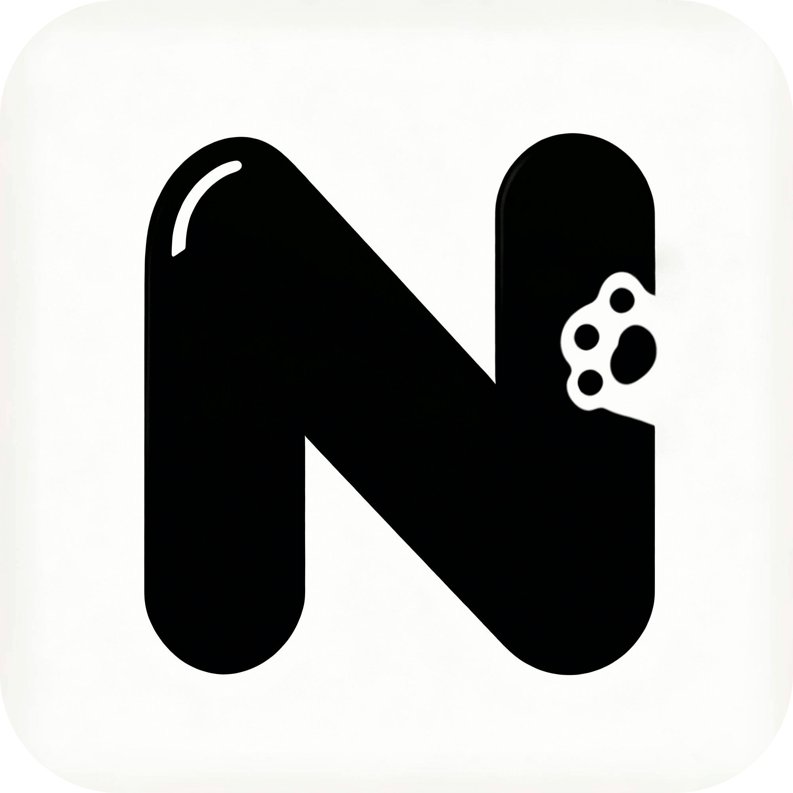
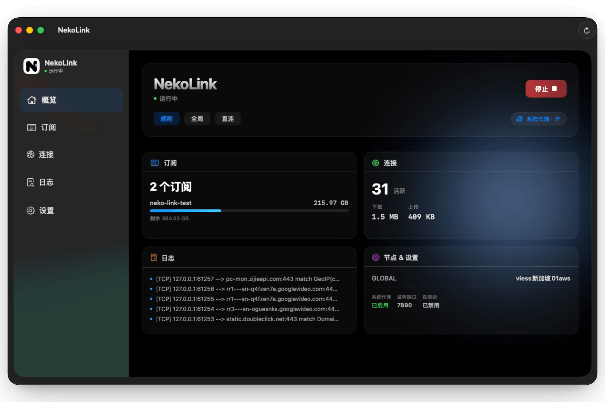

<p align="right">
  <a href="../README.md">简体中文</a> | <strong>English</strong>
</p>

<div align="center">
  
</div>

<h1 align="center">NekoLink</h1>

<p align="center">
  <strong>A native macOS proxy client</strong><br />
  Powered by <a href="https://github.com/MetaCubeX/mihomo">Mihomo</a> · SwiftUI ·
  Zero compromise on smoothness
</p>

<p align="center">
  <a href="https://www.apple.com/macos/"></a>
  <a href="https://swift.org"></a>
  <a href="#license"></a>
  <a href="https://github.com/guokai/NekoLink/releases"></a>
</p>

<div align="center">
  
</div>


## Highlights

- **Menu-bar native** — `NSStatusBar` with a custom `N` letter icon, popover panel for node switching, mode switching, and latency tests
- **Dashboard main window** — Dark theme with beam background, overview cards aggregating subscriptions, connections, logs, and node info
- **Subscription management** — Add, refresh, delete. Scheduled auto-refresh. Traffic usage dashboard
- **Concurrent latency tests** — Animated colored badges. Batch and single-node testing
- **Password-less system proxy** — via a privileged Helper Tool (XPC), reads real state via `networksetup`
- **Live traffic chart** — WebSocket streaming, `Canvas` + `TimelineView` 60fps rendering
- **Log viewer** — WebSocket streaming, level filtering, text search, auto-scroll
- **Active connection inspector** — Sortable table, search filtering, single/batch force-close
- **Launch at login** · **Light/Dark/System appearance** · **Sparkle 2 auto-update** · **Global error toast**


## Install

> **No official release yet.** Download pre-built versions from [GitHub Releases](https://github.com/guokai/NekoLink/releases), or build from source — see [Development](#development).

### Download pre-built package

```bash
# 1. Download the latest NekoLink-x.x.x.zip and unzip
# 2. Bypass Gatekeeper on first launch (unsigned app):
xattr -dr com.apple.quarantine NekoLink.app
# 3. Open normally
open NekoLink.app
```

> Alternatively, **right-click → Open** in Finder and click "Open" in the dialog.

### Coming soon

Once TUN mode is ready, the app will be signed with Developer ID + notarized for a seamless double-click experience.


## Development

### Requirements

- macOS 14+
- Xcode 16+ (Swift 6.0)
- A `mihomo` universal binary (arm64 / x86_64)

### Quick start

```bash
# Drop the mihomo kernel into Resources/
curl -L -o NekoLink/Resources/mihomo \
  https://github.com/MetaCubeX/mihomo/releases/latest/download/mihomo-darwin-arm64
chmod +x NekoLink/Resources/mihomo

# Open the Xcode project (pre-generated, includes extension target)
open NekoLink.xcodeproj
```

Or use the quick rebuild + relaunch script at the repo root:

```bash
./preview.sh
```

### mihomo binary lookup order

Priority high to low:

1. App Bundle `Resources/mihomo`
2. `~/.config/nekolink/mihomo`
3. `/opt/homebrew/bin/mihomo`
4. `/usr/local/bin/mihomo`


## Architecture

```
SwiftUI Views (MenuBar popover + Dashboard main window)
        │
        ▼
AppModel (Global state, Observation)
        │
        ▼
Service Layer
├─ CoreManager          → mihomo process management
├─ MihomoAPI            → RESTful HTTP client
├─ TrafficMonitor       → WebSocket traffic streaming
├─ LogStream            → WebSocket log streaming
├─ ConnectionMonitor    → WebSocket connection streaming
├─ SubscriptionService  → Subscription fetch / parse
├─ SystemProxyService   → Helper XPC password-less proxy
├─ TunnelManager        → TUN mode
├─ MenuBarManager       → NSStatusBar menu bar
├─ LaunchAtLoginService → SMAppService launch at login
├─ AppearanceService    → Theme persistence
└─ UpdaterService       → Sparkle 2 auto-update
        │
        ▼
Kernel: mihomo binary (bundled in Resources)
```


## Roadmap

> Milestone: M0–M2 complete. M4 polish mostly done. Awaiting M3 (TUN mode) and M5 (notarized release). See [落地计划.md](../落地计划.md) for the full milestone plan.

### ✅ Done

- [x] Menu-bar app (`MenuBarExtra`) + node switching / mode switching / latency tests
- [x] Dashboard main window (dark theme, beam background, overview cards)
- [x] Subscription management (CRUD, scheduled auto-refresh, traffic usage dashboard)
- [x] Password-less system proxy (Helper Tool XPC)
- [x] Live traffic chart (`Canvas` + `TimelineView` 60fps)
- [x] Log viewer (streaming, filterable, searchable)
- [x] Active connections (inspect, search, bulk force-close)
- [x] Dock icon always visible + click to restore main window
- [x] Launch at login (`SMAppService`)
- [x] Light / Dark / Follow System appearance
- [x] Global error toast notifications
- [x] Sparkle 2 auto-update (framework wired; needs `SUPublicEDKey` + appcast)

### 🚧 In progress & Planned

- [ ] TUN mode (`NetworkExtension` / `PacketTunnelProvider`) — M3
- [ ] Visual rule editor
- [ ] Multi-profile switch with diff preview
- [ ] iCloud subscription sync
- [ ] Developer ID signing & first GitHub Release — M5


## Release & auto-update

[Sparkle 2](https://sparkle-project.org/) is integrated. Full release flow:

### 1. Generate an EdDSA key (one-time)

```bash
brew install --cask sparkle
generate_keys              # private key goes to Keychain; public key prints to stdout
```

Paste the public key into `NekoLink/Info.plist` as `SUPublicEDKey`.

### 2. Configure the feed URL

`Info.plist` defaults `SUFeedURL` to `https://nekolink.app/appcast.xml`. Point it at your actual Releases endpoint.

### 3. Build, sign, and emit the appcast

```bash
# Build Release, produce NekoLink.app
xcodebuild -project NekoLink.xcodeproj -scheme NekoLink -configuration Release \
  -derivedDataPath build

# Sign with Developer ID and notarize, then drop the resulting NekoLink-<ver>.zip
# into ./releases/ and run:
generate_appcast ./releases/
```

Upload `appcast.xml` together with the zips to wherever `SUFeedURL` points.

The app auto-checks on launch per `SUScheduledCheckInterval` (default 24h). Users can also trigger a manual check via **Menu Bar → Check for Updates** or **Settings → About → Check Now**.


## Contributing

Issues and PRs are welcome! See [CONTRIBUTING.md](../CONTRIBUTING.md) for setup, code standards and PR checklist.


## Acknowledgments

- [**Mihomo**](https://github.com/MetaCubeX/mihomo) — the proxy kernel that does all the real work
- [**Yams**](https://github.com/jpsim/Yams) — YAML parsing
- [**Sparkle**](https://sparkle-project.org/) — auto-update framework
- [**XcodeGen**](https://github.com/yonaskolb/XcodeGen) — project generation


## License

[MIT](../LICENSE) © NekoLink contributors.